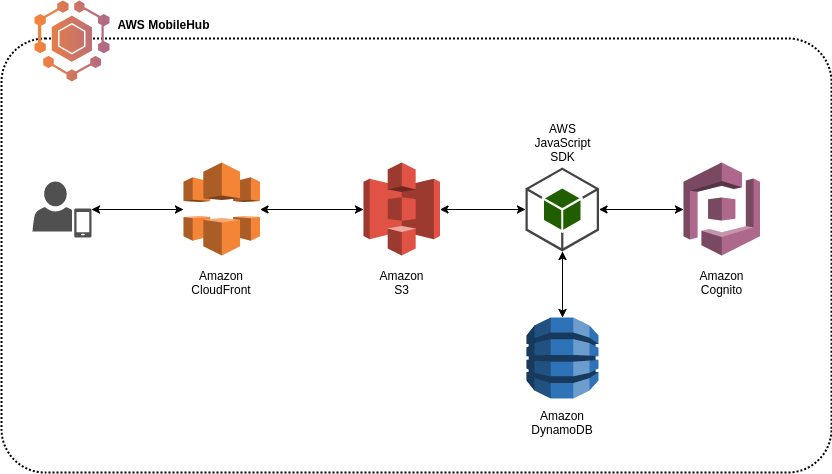

# EmberJS Serverless Web Application

A serverless mobile web application built with EmberJS using import/export as well as Hosting and Streaming functionality from AWS Mobile Hub. 
This web app utilizes AWS MobileHub for it's backend resource automation and the MobileHub generated `aws-config.js`
for connection properties.

For a detailed walkthrough please [follow the blog post](https://aws.amazon.com/blogs/mobile/deploying-an-emberjs-mobile-web-application-mobile-hub/).

## Prerequisites

You will need the following things properly installed on your computer.

* [Git](https://git-scm.com/)
* [Node.js](https://nodejs.org/) (with NPM)
* [Ember CLI](https://ember-cli.com/)
* [PhantomJS](http://phantomjs.org/) (for tests)
* [AWS CLI](https://aws.amazon.com/cli)

## Setup and AWS MobileHub import

When you click on the button below, you will be asked to log into the AWS console (if you are not already logged in). Once logged in, you will be prompted to name the project. Accept the name (or change it), then click Import project.

<a target="_blank" href="https://console.aws.amazon.com/mobilehub/home?#/?config=https://github.com/awslabs/aws-mobilehub-ember/blob/master/AwsMobilehubEmber.zip">

    

</a>

> You can also manually import from the [Mobile Hub Console](https://console.aws.amazon.com/mobilehub/home) by clicking **Import your project** and then dragging the MobileHub.zip file into the screen.

Once the import is complete, click on **Hosting and Streaming**, then **Manage Files** copy/note the Amazon S3 > **your-s3-bucket** at the top of the page. Fork this repo, then, in the root of your cloned project directory run (replace "your-s3-bucket" with the bucket created by MobileHub)

* `git clone https://github.com/awslabs/aws-mobilehub-ember`
* `aws s3 cp s3://your-hosting-bucket/aws-config.js ./vendor/aws-config.js`
* `npm install -g ember-cli`
* `npm install`
* `ember serve`

To test a PWA (Progressive Web App) install the workbox-cli:

* `npm install -g workbox-cli`
* `npm start` 

* Visit your app at [http://localhost:4200](http://localhost:4200).

> You can also download the aws-config.js from the Mobile Hub console. Navigate to your project in Mobile Hub, click on **Hosting and Streaming**, then click on **Download aws-config.js file**.

## Updating from Mobile Hub

If you update your AWS Mobile Hub project by adding or removing features you will need an updated `aws-config.js` file. You can do this by runing the following (from the root of your project):

    aws s3 cp s3://your-hosting-bucket/aws-config.js ./vendor/aws-config.js

This will download the new `aws-config.js` file with the new configuration values. No update 
to the app should be neccisary unless you added new functionality. In that case even,
you can simply refer to the new constants within the Ember app.

### Ember Code Generators and Adapters

Make use of the many generators in Ember.js for your code, try `ember help generate` for more details. This app comes
with a pre-built adapter for DynamoDB, located in app/adapters. This adapter abstracts the DynamoDB backend logic so
that within your controllers you can work with Ember models.

 - app/adapters/note.js 				-> Ember adapter for interacting with DynamoDB
 - app/serializers/node.js 				-> Serializes data returned from AWS APIs for Ember model data
 - app/models/note.js 					-> Ember model for our DynamoDB items
 - app/initializers/aws.js 				-> AWS JS SDK bootstrap and initialization
 - app/instance-initializers/auth.js 	-> Injection of Cognito resources (authenticated user) into Ember services
 - app/services/cognito.js 				-> Amazon Cognito Ember service

### Running Tests

* `ember test`
* `ember test --server`

### Building

* `ember build` (development)
* `ember build --environment production` (production)

### Building PWA (Progressive Web App)

Make sure you have workbox installed, then run the npm script:

* `npm install -g workbox-cli`
* `npm run build`

Deploy the contents of the dist directory.

### Deploying for Test and Production

Mobile Hub will create an S3 static location for testing purposes and a CloudFront distribution for CDN deployment of your application. To deploy the app to your MobileHub generated S3 hosting bucket and CloudFront, use the S3 bucket name obtained above, and simply run from your projects root directory: 

    ember build
    aws s3 cp --recursive ./dist s3://your-s3-bucket/

### Deploying PWA (Progressive Web App)

Make sure you have workbox installed, then run the npm script:

* `npm install -g workbox-cli`
* `npm run build`

Then visit your S3 static web hosts url. To retrieve this:

1. Go to your MobileHub project and click on **Hosting and Streaming**
2. Click on the tile **View from S3** 

After a bit of time the file changes you pushed will also propigate to the CloudFront Distribution so that you can click the **View from CloudFromt** tile and browse the site from a CDN for faster performance. You can force this refresh to happen immediately from the **Hosting and Streaming** page:

1. Click **Edit your CDN distribution**
2. Click the **Invalidations** tab
3. Select **Create Invalidation** and enter an asterisk (*) to refresh all the content

Once the process completes click the **View from CloudFront** tile in the **Hosting and Streaming** section of Mobile Hub.

NOTE: If you would like browser URLs to route directly to your Ember routes e.g. visiting http://your-s3-host/home etc. You should add
"index.html" to the **Error document** as well in your CloudFront distribution.

### Making changes

Each time you make changes to the application it will need to be built and deployed.  To build and copy to S3:

    ember build
    aws s3 cp --recursive ./dist s3://your-s3-hosting-bucket/

Then as above either wait for a CloudFront Distribution refresh or force one with an invalidation. We recommend you do development locally testing using `ember serve` and perform the above process for integration testing and deployments.

## Troubleshooting

### 404/403 etc. type http errors from CloudFront

Sometimes with dynamic JavaScript apps it is usful to add error code mapping to allow the client application to handle the Errors:

 - Sign in to the AWS Management Console and open the [CloudFront console](https://console.aws.amazon.com/cloudfront/)
 - Click on your distribution
 - Navigate to the **Error Pages** Tab and click **Create Custom Error Response**
 - Choose the error code, click "Yes" to Customize Error Response
 - Enter "/" (without quotes) in the Reponse Page Path, and choose 200 HTTP Response Code

 Usually you'll want to do this for at least 400 and 403 error codes with most JavaScript frameworks.

## Further Reading / Useful Links

* [ember.js](http://emberjs.com/)
* [ember-cli](https://ember-cli.com/)
* Development Browser Extensions
  * [ember inspector for chrome](https://chrome.google.com/webstore/detail/ember-inspector/bmdblncegkenkacieihfhpjfppoconhi)
  * [ember inspector for firefox](https://addons.mozilla.org/en-US/firefox/addon/ember-inspector/)
